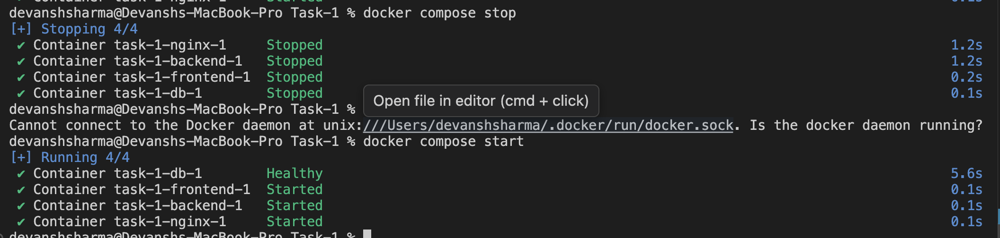
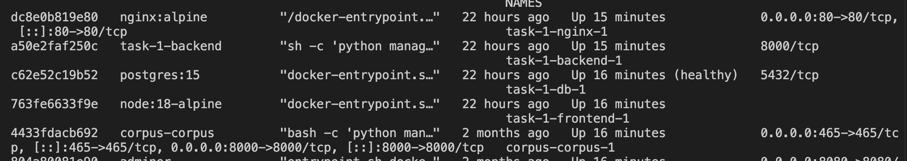
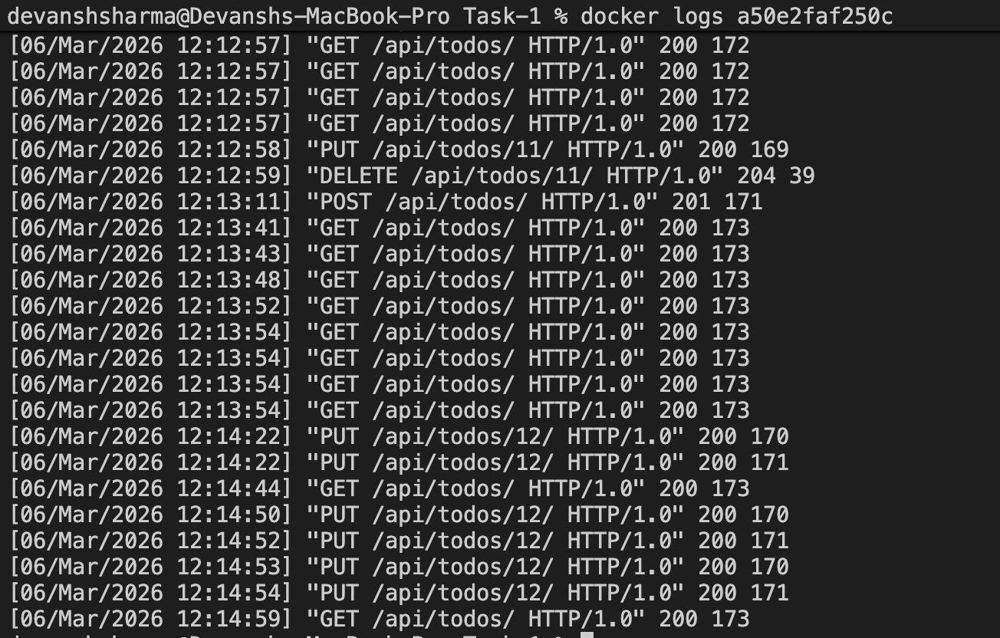
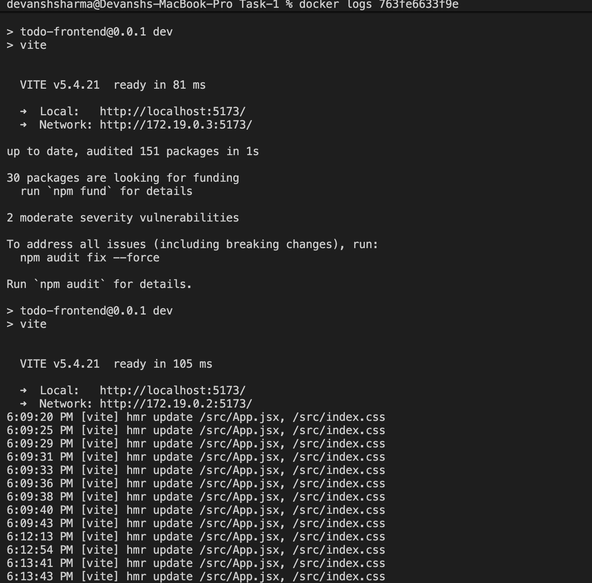
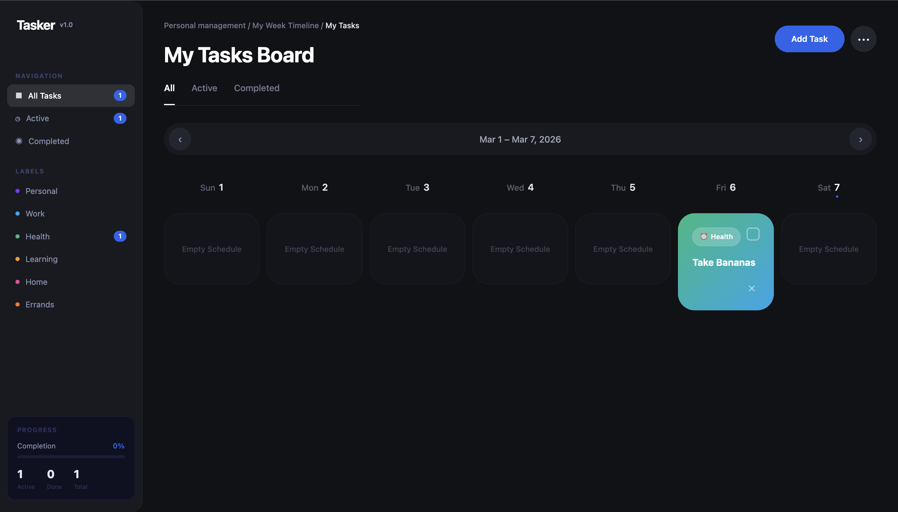

---

# Objective

This is a task which aims for me to understand Docker better for the main tasks to follow afterwards. This Repo focusing on a Todo Application build with the help of docker for containerisation where database, frontend and backend exist in their respective containers inside our app and operating inside our docker network.

---

## Steps / Implementation

- I intially started with the backend in Django where I defined the requirements.txt and manage.py first.
  Created models.py ,serializers,views and url.py . Properly Initialised the settings.py and migrations after it. Wrote the Dockerfile for it to end the backend part 

- for frontend , I followed the similar approach but first made a simple todo ui just to get things running and then afterwards used some template from Figma for better UI/UX.

- Created a docker-compose file for my final docker commands to run the containers properly and Viola , it was working fine.

---

## Observations / Outputs

- Screenshots of docker containers, frontend and backend container logs

### Screenshot 1

### Screenshot 2

### Screenshot 3

### Screenshot 4

### Screenshot 5

---

## Issues Faced & Fixes

Mainly I was trying to create the setup from scratch which was exhausting and that was the main issue . Now from the next task I think it will be better to create the setup using the environment commands instead of relying for it to work when the docker compose is up. This will basically allow me to debug better and also since the image will finally be created, it will still fullfill its purpose of containerisation.
---